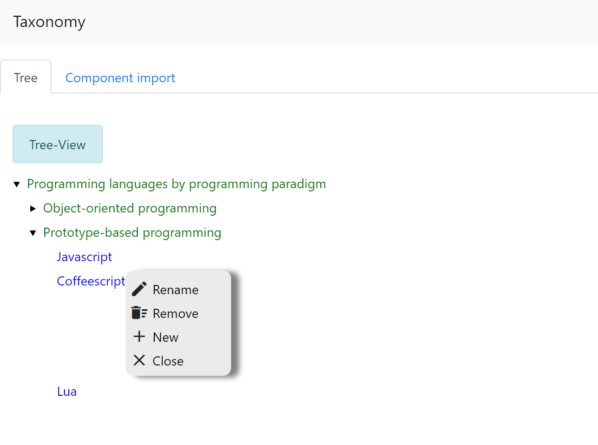

# Taxonomy genrator using AngularJS and angular-tree-component usage

Basic Taxonomy generated using the angularJs modular architechture

# Technologies used:
- [AngularJs](https://angular.io/)
- [npm](https://www.npmjs.com/)
- [Angular-Tree-Component](https://github.com/500tech/angular-tree-component)

# Screenshots:

